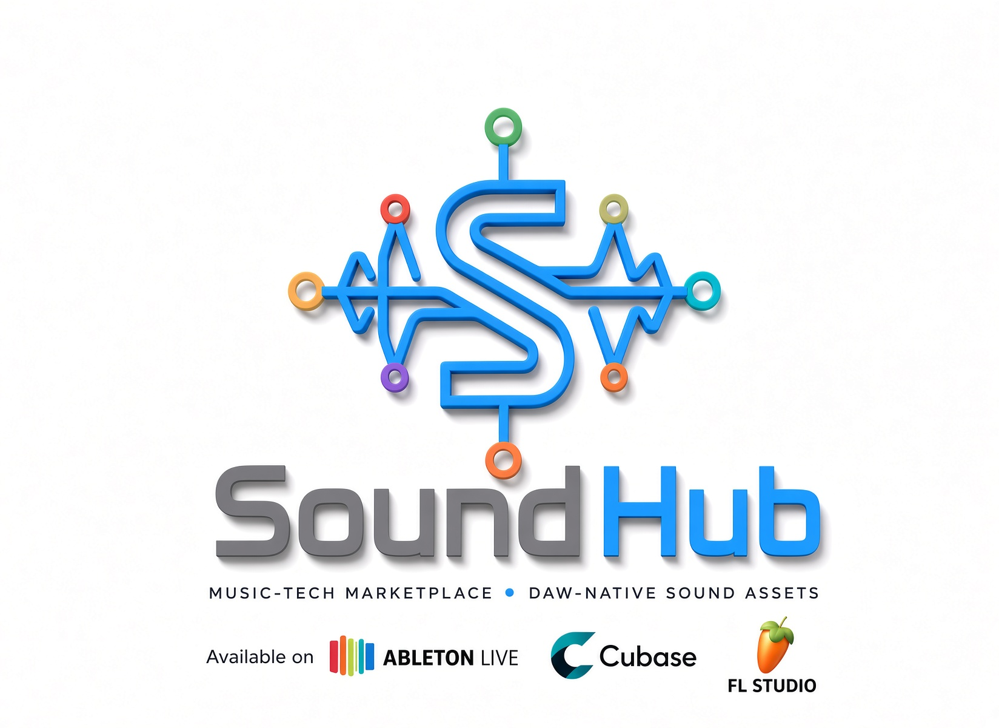
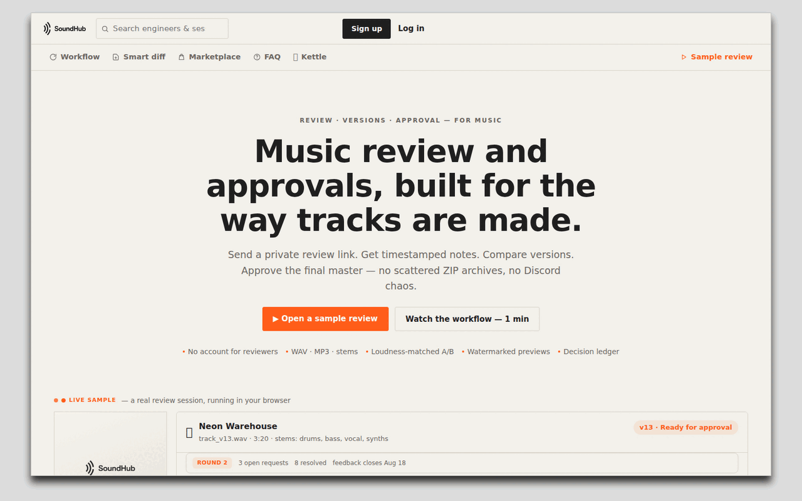
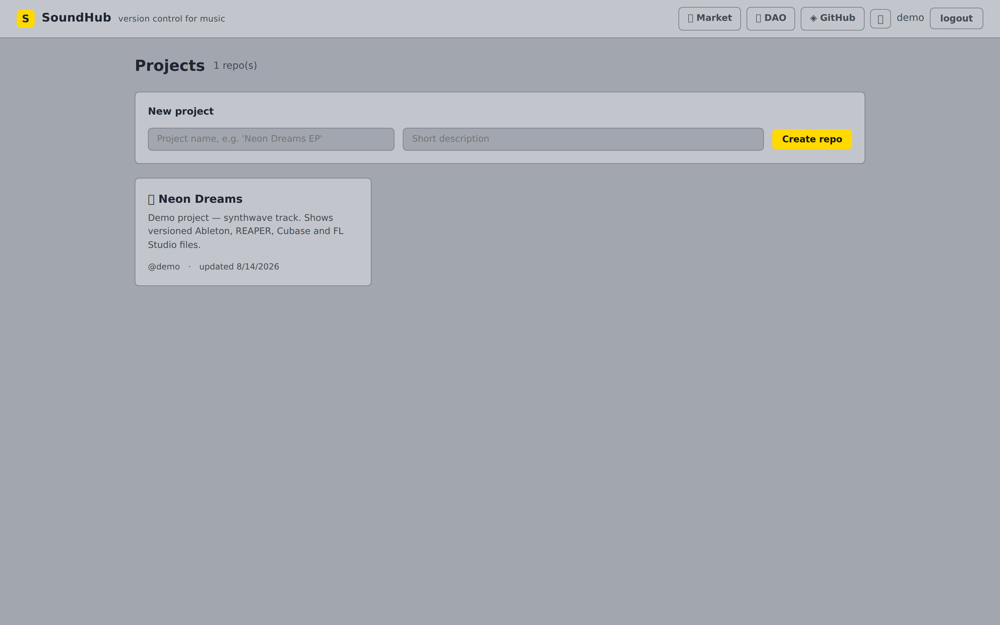
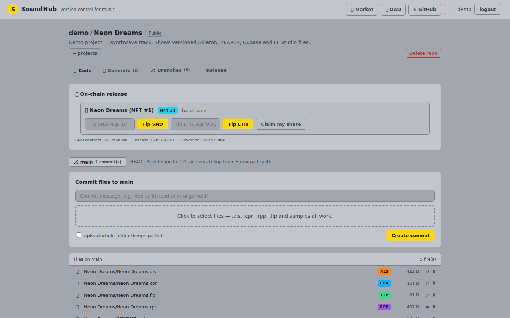
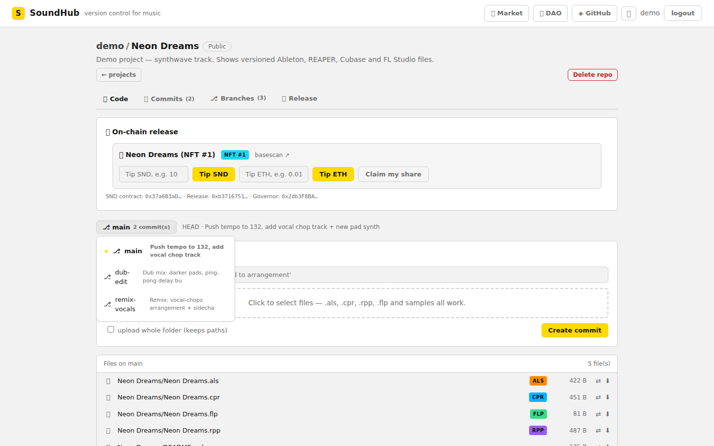

<div align="center" style="margin: 20px 0px;">
<a href="https://github.com/CRYPTOSCOPE101/SoundHub/actions/workflows/ci.yml">
  
</a>
<a href="https://github.com/CRYPTOSCOPE101/SoundHub/actions/workflows/release.yml">
  
</a>
<a href="https://github.com/CRYPTOSCOPE101/SoundHub/releases">
  
</a>
<a href="https://github.com/CRYPTOSCOPE101/SoundHub/issues">
  
</a>
<a href="https://github.com/CRYPTOSCOPE101/SoundHub/stargazers">
  
</a>
<a href="LICENSE">
  
</a>
</div>

# 🎛 What is SoundHub?

SoundHub is a tokenized marketplace where music producers buy and sell finished presets, loops, stems, and sound packs with on-chain ownership and licensing

**Don't generate. Buy. — the marketplace lives inside your DAW.** Presets,
loops, stems and packs, paid for with SND — from the SoundHub panel in
Ableton Live (Max for Live prototype in `m4l/`) or the web app.







📄 Read the [Project description](DESCRIPTION.md) — what SoundHub is, live
features vs roadmap, and how it compares to existing tools.

📄 Read the [Litepaper](LITEPAPER.md) — vision, tokenized layer, tokenomics
and roadmap.

🎛 **SoundHub inside Ableton Live** — Max for Live prototype that embeds the
marketplace in the DAW: catalog, BPM-aware suggestions, buy & load. See
[`m4l/`](m4l/) and the [integration architecture](ARCHITECTURE.md).

GitHub, but for DAW projects — Ableton Live (`.als`), Cubase (`.cpr`),
REAPER (`.rpp`) and FL Studio (`.flp`). Version your tracks, see *what
actually changed* between versions (not just "file modified"), and
collaborate without zip-files floating around a Discord server.

## Why this is different from git/GitHub

DAW project files are opaque blobs to normal version control. GitHub
shows you "this 40 MB binary changed" and nothing else.

SoundHub parses the project files and understands them:

| | GitHub on `.als` | SoundHub on `.als` |
|---|---|---|
| Diff | "binary file changed" | **BPM 128 → 132** |
| | | **+ track `Pad` (midi)** |
| | | **+ plugin `Vital`** |
| | | **+ sample `VocalChop_01.wav`** |
| Metadata | nothing | tracks, devices, plugins, samples, signature |

It also stores files **content-addressed** (deduplicated by SHA-256), so a
full-snapshot commit model costs almost nothing when little changed.

## Stack

- **Backend:** Python 3.12 · FastAPI · SQLAlchemy · SQLite · PyJWT
- **Frontend:** React 18 · TypeScript · Vite
- **Storage:** content-addressed blobs on disk (`backend/data/blobs/`),
  no external services required

## Quick start

```bash
# 1. Backend
cd backend
python3 -m venv .venv
.venv/bin/pip install -r requirements.txt
.venv/bin/python -m scripts.seed_demo     # demo user: demo / demo123
.venv/bin/uvicorn app.main:app --port 8000

# 2. Frontend (new terminal)
cd frontend
npm install
npm run dev          # http://localhost:5173

# 3. Open http://localhost:5173 and sign in with demo / demo123
```

## Tests

```bash
# Backend
cd backend
.venv/bin/python -m pytest tests/ -q

# Contracts (compile + 12 tests: token, royalties, splits, escrow, faucet, DAO)
cd contracts
npm test

# Frontend (tsc + vite build)
cd frontend
npm run build
```

All three run automatically in [CI](.github/workflows/ci.yml) on every push
and pull request.

## Releases

Tag a version and CI publishes a [GitHub Release](.github/workflows/release.yml)
with the built Max for Live device:

```bash
git tag v0.1.0 && git push origin v0.1.0
```

## API overview

| Method | Endpoint | Description |
|---|---|---|
| POST | `/api/auth/register` | create account |
| POST | `/api/auth/login` | get JWT |
| GET | `/api/projects` | list repos |
| POST | `/api/projects` | create repo |
| GET | `/api/projects/{id}/tree` | file tree of HEAD (with DAW analysis) |
| POST | `/api/projects/{id}/commits` | upload files → new commit |
| GET | `/api/projects/{id}/commits` | history |
| GET | `/api/projects/{id}/files/{path}` | download a file |
| GET | `/api/projects/{id}/diff?path=…&from=…&to=…` | smart diff |

## DAW parsing engine (`backend/app/services/daw/`)

| Format | File | Approach |
|---|---|---|
| Ableton Live | `als_parser.py` | gunzip → XML → tempo, signature, tracks, devices, plugins, samples |
| Cubase | `cpr_parser.py` | XML scan → tempo, tracks, VST plugins |
| REAPER | `rpp_parser.py` | text parse → tempo, signature, tracks, FX |
| FL Studio | `flp_parser.py` | binary chunk walk (FLhd/FLPI/FLdt) → version, name, author, tempo |
| Diff engine | `diff_engine.py` | structured summary diff + unified raw diff (pretty XML / text / hex) |

## Roadmap — marketplace first (don't generate, buy)

- [x] Foundation: repos, snapshot commits, content-addressed storage
- [x] DAW parsing for all four formats + smart metadata diff
- [x] Tokenized layer: SND, Release NFTs, DAO, wallet sign-in (Base Sepolia)
- [x] `SoundHubMarket` escrow contract (tested, deployed on Base Sepolia)
- [x] Marketplace UI: list/buy/confirm/refund + SND faucet (100 SND/day)
- [x] In-DAW prototype: SoundHub inside Ableton Live (M4L, `m4l/`) — catalog, BPM suggestions, buy & load
- [x] Recommendation service (`/api/assets/recommend`, DAW-metadata scoring) + asset delivery (signed-token download)
- [x] Auto-import into Live: `/download64` → User Library write → browser refresh
- [x] Repo-first UI (own design): repo tabs, branch selector, commits view, README; Ableton light/dark themes; SoundHub-repo page via GitHub API
- [x] Branches: named pointers, per-branch history/tree/diff (merges: DAG — next)
- [ ] Token gating on purchase, one-click device insert, key/tracks/devices context from Live API
- [ ] Verification badges (DAW-parsed), seller reputation, license enforcement
- [ ] Merges (DAG), audio preview, real-time collab
- [ ] WalletConnect signing in M4L / relayer; FL Studio, Cubase, REAPER equivalents
- [ ] S3/Azure blob backend for production scale

## Tokenized platform (web3) 🪙

SoundHub is a tokenized platform on **Base** (EVM). Four smart contracts
live in `contracts/` (Hardhat + OpenZeppelin):

| Contract | What it does |
|---|---|
| `SND.sol` | **SND** ERC-20 platform token — permit, votes for the DAO, fixed supply, marketplace payment rail |
| `SoundHubRelease.sol` | **Release NFTs** (ERC-721 + ERC-2981) — music releases with royalty %, on-chain collaborator revenue split, fundable treasury (ETH/SND) with order-independent claiming |
| `SoundHubMarket.sol` | **Escrow marketplace** — list finished sounds for SND, buy into escrow, dispute window, refunds |
| `SoundHubFaucet.sol` | **Testnet faucet** — 100 SND per wallet per day so testers can buy |
| `SoundHubGovernor.sol` | **DAO** — SND holders propose/vote, execution via 1-day timelock |
| `TimelockController` | safety delay before any executed proposal |

### Features wired into the app
- **Sign in with wallet** (EIP-191 personal_sign verified server-side, JWT issued)
- **Marketplace** — list finished sounds for SND, buy through escrow, confirm receipt, request refunds
- **SND faucet** — claim 100 testnet SND per day to try buying
- **Mint a Release NFT** per project — set royalty and collaborator split
- **Tip artists** — fund a release treasury with SND or ETH, collaborators claim on-chain
- **DAO page** — connect wallet, see voting power, vote on proposals

### Deploy

```bash
cd contracts
npm install
cp .env.example .env            # set DEPLOYER_PRIVATE_KEY
npm run deploy:base-sepolia     # or: deploy:base for mainnet
```

The deploy script writes addresses to `deployments/{network}.json` and copies
them to `frontend/public/contracts.json` so the UI connects automatically.
Contracts are verified against real transactions in the test suite
(`npx hardhat test`, 12 tests covering token, royalties, splits, escrow
marketplace, faucet and the full propose → vote → queue → execute DAO flow).

## Security note

- MVP uses a dev JWT secret — set `SOUNDHUB_SECRET_KEY` and tighten CORS
  (`allow_origins`) before any real deployment.
- Smart contracts are unaudited — test on testnet first.
- SND supply is fixed (1,000,000) — no mint function.
